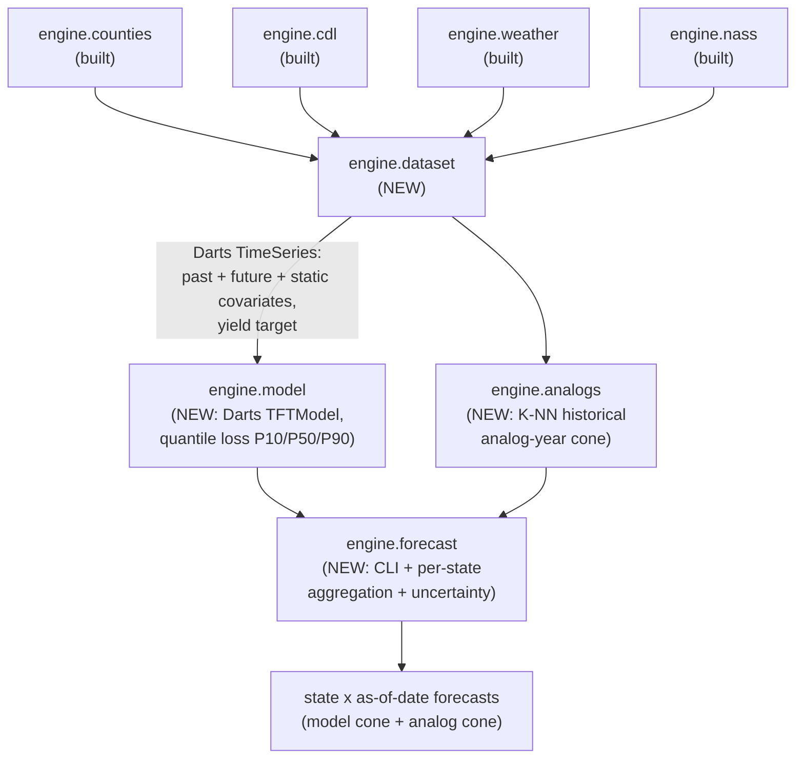

# TFT Crop Yield Pipeline — Implementation Plan

## 1. What we're building

End-to-end, four new modules on top of the existing engine, plus tests, plus a CLI:



Library: **Darts** (Unit8). TFT class: `darts.models.TFTModel`. Quantile loss: `darts.utils.likelihood_models.QuantileRegression`. Skip Prithvi for v1.

## 2. Data shape for TFT

One time series per `(geoid, year)`, daily index over the growing season `April 1 (DOY 91) → November 30 (DOY 334)` = **244 days/series**.

Four input categories (TFT's required signature):

- **Static covariates** (1 row per series) — from CDL + counties:
  `state_fips` (categorical), `corn_pct_of_county`, `corn_pct_of_cropland`, `corn_area_m2`, `soybean_pct_of_cropland`, `centroid_lat`, `centroid_lon`, `land_area_m2`.
- **Past observed covariates** (daily, encoder window) — from weather:
  `PRECTOTCORR, T2M, T2M_MAX, T2M_MIN, GWETROOT, GWETTOP, SMAP_surface_sm_m3m3, NDVI, NDWI, GDD, GDD_cumulative` plus the `_7d_avg` / `_30d_avg` rollups already in [software/engine/weather/features.py](software/engine/weather/features.py).
- **Known future covariates** (daily, decoder window) — calendar only for v1:
  `day_of_year` (sin/cos), `week_of_year`, `month`, `days_until_end_of_season`. Live weather forecasts (GEFS) are an explicit non-goal for v1.
- **Target** — `nass_yield_bu_acre` from [software/engine/nass/core.py](software/engine/nass/core.py), broadcast to every daily step in the series; model is trained to predict yield at the final decoder step.

## 3. Forecast-date strategy

Train **four separate TFTModel instances**, one per forecast date. Each with a fixed encoder/decoder split:

- Aug 1 model: `input_chunk_length=122` (Apr 1 → Aug 1), `output_chunk_length=122` (Aug 1 → Nov 30)
- Sep 1 model: `input_chunk_length=153`, `output_chunk_length=91`
- Oct 1 model: `input_chunk_length=183`, `output_chunk_length=61`
- Final model: trained on full season (no decoder, point estimate at Nov 30)

Rationale: each model sees the right covariate availability; cleanest to debug; cheapest to train per model on hackathon hardware. We can always collapse to one model later.

## 4. Cone of uncertainty (two layers)

1. **Model cone** — TFT trained with `QuantileRegression(quantiles=[0.1, 0.5, 0.9])` produces P10/P50/P90 natively. Free with Darts.
2. **Analog-year cone** — `engine.analogs` finds K=5 historical years whose season-to-date weather signature is closest (Euclidean over normalized [cumulative GDD, cumulative precip, mean NDVI through forecast date]) and returns the empirical [min, P25, P50, P75, max] of those years' realized NASS yields. This is what the [problem statement PDF](documentation/CSU%20Hackathon%20-%20Geospatial%20AI%20Crop%20Yield%20Forecasting_FINAL.pdf) explicitly asks for.

Both surfaced side-by-side in the final report so judges see the model uncertainty *and* the analog evidence.

## 5. New files

```
software/engine/
├── _logging.py              # NEW: central logger, banner(), log_environment(), CLI flag wiring
├── dataset.py               # NEW: assemble Darts TimeSeries from the 4 sources
├── model.py                 # NEW: TFTModel wrapper (build / fit / predict / save / load) + PL callbacks
├── analogs.py               # NEW: K-NN analog-year cone
└── forecast.py              # NEW: end-to-end CLI

software/tests/
├── test_logging_smoke.py    # NEW: banner + file sink + env dump on a temp log dir
├── test_dataset_smoke.py    # NEW: builds 1-county-1-year TimeSeries, asserts schema, asserts 2025-leak guard raises
├── test_model_smoke.py      # NEW: trains 5-step toy TFT, asserts forward pass, asserts CSV epoch logger writes
├── test_analogs_smoke.py    # NEW: deterministic K-NN over fixture frame
└── test_forecast_smoke.py   # NEW: end-to-end pipeline on cached parquet fixtures
```

Plus updates to:

- [pyproject.toml](pyproject.toml) — add `[project.optional-dependencies]` group `forecast = ["darts>=0.30", "torch>=2.2", "pytorch-lightning>=2.2", "scikit-learn>=1.4"]`. Register console scripts `hack26-train` and `hack26-forecast`.
- [software/engine/__init__.py](software/engine/__init__.py) — lazy-export `build_dataset`, `train_tft`, `forecast_state`, `analog_cone` per the existing lazy-import pattern.
- [software/SPEC.md](software/SPEC.md) — add §12 "Model + Forecast" describing the new modules; promote the dashed `Model` and `Forecast` boxes in the §2 architecture diagram from `:::planned` to solid.

## 6. Module-by-module sketch

### 6.1 `engine.dataset`

```python
def build_training_dataset(
    states: list[str] | None = None,
    start_year: int = 2008,
    end_year: int = 2024,
    season_start_doy: int = 91,    # Apr 1
    season_end_doy: int = 334,     # Nov 30
    include_sentinel: bool = True,
) -> TrainingBundle:
    """Returns:
      - target_series:     list[TimeSeries]  one per (geoid, year), len=244
      - past_covariates:   list[TimeSeries]  same shape, weather features
      - future_covariates: list[TimeSeries]  calendar features
      - static_covariates: pd.DataFrame      one row per series (CDL + county)
      - series_index:      pd.DataFrame      (geoid, year, state_fips, label)
    """
```

Internally:
- Calls `load_counties(states)` once.
- Calls `fetch_counties_weather(...)` (cached) once for the full year span.
- Calls `fetch_counties_cdl(...)` for each year and concatenates.
- Calls `fetch_counties_nass_yields(...)` to get the labels.
- Drops `(geoid, year)` rows where the label is missing or weather coverage is < 95%.

### 6.2 `engine.model`

```python
def build_tft(forecast_date: str) -> TFTModel:
    """forecast_date in {'aug1', 'sep1', 'oct1', 'final'} -> TFTModel
    with the right input/output chunk lengths and quantile loss."""

def train_tft(bundle: TrainingBundle, forecast_date: str,
              epochs: int = 30, batch_size: int = 64,
              val_year: int = 2023) -> TFTModel: ...

def predict_tft(model: TFTModel, bundle: TrainingBundle,
                target_year: int) -> pd.DataFrame:
    """Returns one row per geoid: yield_p10, yield_p50, yield_p90."""

def save_tft(model, path) / load_tft(path)  # Darts native checkpoint API
```

Checkpoints land at `~/hack26/data/derived/models/tft_{date}_{train_end_year}.pt` (same data root convention as the rest of the engine).

### 6.3 `engine.analogs`

```python
def analog_cone(geoid: str, target_year: int, as_of: str,
                history_years: list[int], k: int = 5) -> dict:
    """K-nearest historical years matched on cumulative-GDD,
    cumulative-precip, mean-NDVI through `as_of`. Returns
    {analog_years, yield_min, yield_p25, yield_p50, yield_p75, yield_max}.
    Pulls features from cached weather + NASS — no live API calls."""
```

### 6.4 `engine.forecast`

CLI:
```bash
hack26-forecast --year 2025 --as-of 2025-08-01 --states Iowa Colorado \
    --out forecasts_2025_aug1.parquet
hack26-forecast --year 2025 --all-dates --out forecasts_2025.parquet
```

Pipeline per call:
1. Build dataset for `target_year` only (covariates, no label).
2. Load matching trained checkpoint from `derived/models/`.
3. Run `predict_tft` → per-county `(p10, p50, p90)`.
4. Run `analog_cone` per county → analog quantiles.
5. Aggregate to per-state: corn-area-weighted mean of county P50, weighted P10/P90 via per-state quantile of the per-county distribution.
6. Compare against `fetch_nass_state_corn_forecasts` baseline (USDA's official line) so judges see "us vs USDA" side-by-side.
7. Write parquet/CSV.

## 7. Training plan — two-pass, 2025-strict-holdout

**Hard constraint: 2025 is OFF LIMITS for any training, validation, or feature engineering.** It is the deliverable forecast year and our only true out-of-sample benchmark.

We do this in **two passes** so we can both report a credible accuracy number *and* ship the strongest possible 2025 forecast.

### Pass 1 — Measurement (for the deck)

Goal: produce an honest, fully out-of-sample accuracy number on **2024** (NASS finals are published) so the deck can claim "X bu/acre RMSE on the most recent fully observed season".

- **Train years:** 2008–2022 (15 seasons)
- **Val year (early stopping):** 2023
- **Test year (reportable):** 2024
- Output: `~/hack26/data/derived/models/measurement/tft_{aug1,sep1,oct1,final}.pt` plus a CSV `~/hack26/data/derived/reports/test_2024_metrics.csv` (per-state RMSE / MAPE / [P10, P90] coverage).

CLI: `hack26-train --forecast-date all --train-years 2008-2022 --val-year 2023 --test-year 2024 --out-dir measurement`.

### Pass 2 — Deliverable (for the 2025 forecast)

Goal: maximum signal for the 2025 forecast by folding 2024 back into training. This is the standard "after CV, retrain on all available data" pattern.

- **Train years:** 2008–2024 (17 seasons — uses the 2024 NASS finals the user explicitly OK'd including)
- **Val year (early stopping):** 2023 (kept identical to Pass 1 so the early-stopping behavior matches; 2024 is now in train so we can't use it for val)
- **Test year:** *none* — 2025 is the only thing we can hold out and that's the deliverable, not a benchmark.
- Output: `~/hack26/data/derived/models/final/tft_{aug1,sep1,oct1,final}.pt`. These are the weights that produce the deliverable.

CLI: `hack26-train --forecast-date all --train-years 2008-2024 --val-year 2023 --no-test --out-dir final`.

### Leak prevention (enforced in code)

- `engine.dataset.build_training_dataset(end_year=...)` clamps `end_year ≤ 2024` and raises `ValueError` if `2025` is requested for any role except inference covariates.
- The `nass.fetch_counties_nass_yields` call is wrapped to drop any row with `year == 2025` before label assignment.
- Logged at INFO on every training run: `"[train] year_split: train=2008-202X val=202X test=...; 2025_in_data=False"`.

### Loss + reported metrics

- Loss: `QuantileRegression(quantiles=[0.1, 0.5, 0.9])`.
- Per-state RMSE and MAPE of P50 vs NASS final.
- Interval coverage: fraction of held-out (state, year) pairs where the realized NASS yield falls inside [P10, P90] (target: ~80%).

## 8. Logging — exhaustive, paste-back-friendly

This is a hackathon with cluster runs, so every new module logs aggressively to **both stderr and a per-run log file** so you can paste the file or terminal output here for me to debug. No `print()` calls in the new modules — everything goes through the central logger.

### 8.1 `engine/_logging.py` (new)

Single module that every other new file imports. Configures:

- `RichHandler` (or stock `StreamHandler` if Rich isn't installed) on stderr with timestamp + level + module name + message.
- `RotatingFileHandler` writing to `~/hack26/data/derived/logs/{module}_{YYYYMMDD_HHMMSS}.log` (rotated at 50 MB × 5 files).
- `get_logger(name)` returns a configured logger.
- `banner(title, char="=", width=72)` prints a fenced section header to make `grep` and visual scanning easy:
  ```
  ========================================================================
  STEP 3/7  Building Darts TimeSeries (244 days x 7,544 series)
  start: 2026-04-25 04:18:33  |  pid: 12453  |  host: ip-10-0-1-42
  ========================================================================
  ```
- `set_verbosity(level)` honors `--verbose` / `--debug` CLI flags.
- `log_environment()` — called once at the top of every CLI: dumps Python version, torch version, CUDA available + device name + VRAM, free disk on data root, env vars (`HACK26_*`, `NASS_API_KEY` masked), and the git SHA + dirty status.

### 8.2 What every module logs

| Module | INFO logs (always on) | DEBUG logs (`--verbose`) |
| --- | --- | --- |
| `engine.dataset` | banner per pipeline step; `n_counties`, `n_years`, `n_series_built`, `n_series_dropped_missing_label`, `n_series_dropped_low_coverage`; total feature count per category; per-source cache hit/miss summary; output parquet path + row count + bytes | per-county fetch timings, per-year shape, per-series NaN audit |
| `engine.model` | banner per (forecast_date, pass); chosen `input_chunk_length`/`output_chunk_length`; n_train / n_val series; model param count; per-epoch line `epoch=N train_loss=X val_loss=Y lr=Z elapsed=Ts samples/sec=K vram_gb=V`; checkpoint path on save; load path + epoch + val_loss on load | per-batch loss every N batches, gradient norms, attention head stats |
| `engine.analogs` | banner; per (geoid, as_of) the K analog years selected + their distance + their realized yields; aggregate quantiles | full distance matrix + feature vectors used |
| `engine.forecast` | banner; model paths loaded; per-state aggregation formula + weights; per-state output row (P10, P50, P90, analog_min..max, NASS_baseline); output file path + row count + bytes; total wall time | per-county prediction + analog cone before aggregation |

### 8.3 Per-epoch CSV (training)

In addition to stderr logging, training writes `~/hack26/data/derived/logs/train_{forecast_date}_{pass}_{timestamp}.csv` with one row per epoch — columns: `epoch, train_loss, val_loss, lr, elapsed_s, samples_per_sec, vram_gb`. Easy to paste, easy to `pd.read_csv` for a loss plot in the deck.

### 8.4 PyTorch Lightning hooks

Darts wraps PL, so:

- Pass `pl_trainer_kwargs={"callbacks": [RichProgressBar(), CsvEpochLogger(...), GpuMemoryLogger()]}` to `TFTModel`.
- `CsvEpochLogger` is a tiny custom `Callback` that appends to the CSV above on `on_validation_epoch_end`.
- `GpuMemoryLogger` logs peak/current VRAM each epoch (since OOM kills on the AWS box are common).

### 8.5 CLI flags wired into every new entry point

```
--verbose / -v        DEBUG-level logging
--quiet / -q          WARNING+ only
--log-file PATH       additional file sink (in addition to the rotated default)
--no-color            disable Rich color (for piping to a file you'll paste back)
```

All four new CLIs (`hack26-train`, `hack26-forecast`, plus `python -m engine.dataset --dump-stats` and `python -m engine.analogs --inspect`) accept these flags.

## 9. Non-goals for v1 (explicit)

- No Prithvi / HLS embeddings (deferred per your call).
- No live GEFS weather forecasts in the decoder window — calendar-only future covariates; weather climatology fills are a v1.1 add.
- No sub-county ROIs in the trained model (the engine contract supports them, but training data is county-level).
- No ensembling against PatchTST/N-HiTS — the TFT.md research argues this is the right primary architecture for our setup; ensembling is a v2 nice-to-have.

## 10. Open dependencies and risks

- Darts pulls in **torch + pytorch-lightning** (~2 GB extra installed). Gated behind the `[forecast]` extra so the existing engine install isn't bloated.
- Optional `rich>=13` added to the `[forecast]` extra for prettier logs/progress bars; logger gracefully falls back to stock `logging.StreamHandler` if Rich isn't importable, so the AWS box never hard-fails on a UI dep.
- First training run hits NASA POWER for 17 years × 443 counties (~7.5K cached parquet files). Plan for a one-time 2–4 hour cold pull on the AWS box, then everything is parquet-cache reads. Logged at INFO with a per-county counter so you can see progress in real time.
- TFT on ~7,500 series × 244 timesteps × ~50 features per timestep is manageable on a single GPU (the AWS workshop instance) in ~30 min/model. Pass 1 (4 models) + Pass 2 (4 models) ≈ 4 hours of GPU time total.