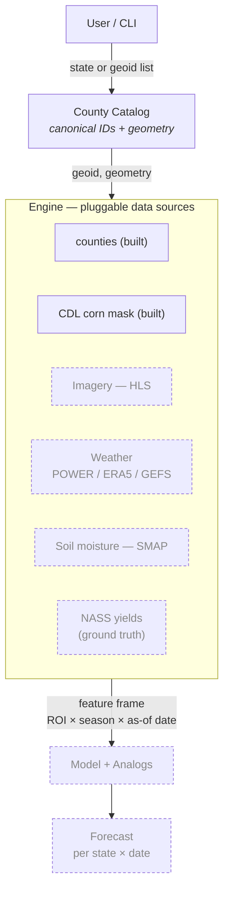
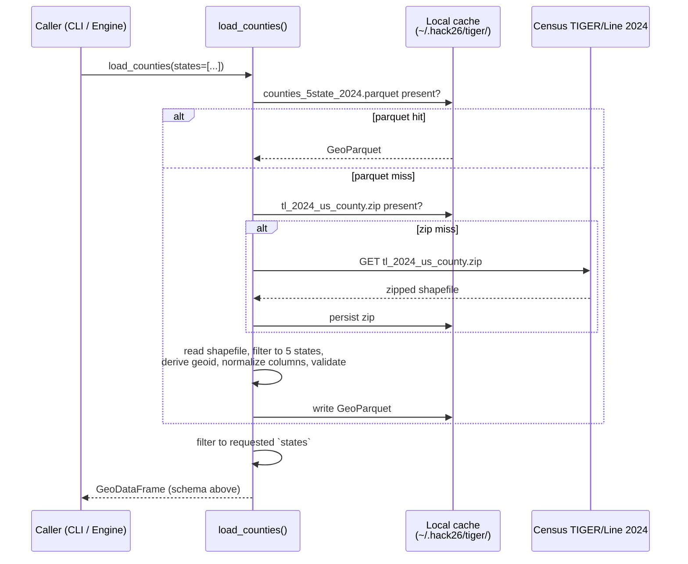
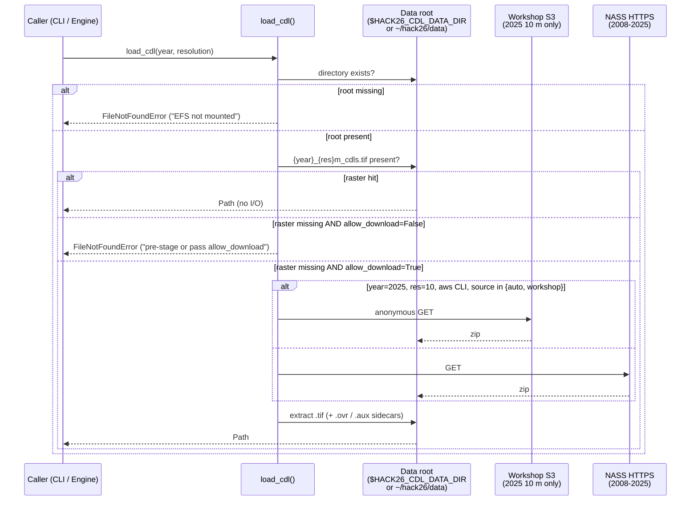

# Geospatial AI Crop Yield Forecasting — System Spec

## 1. Problem

Forecast **corn-for-grain yield (bu/acre)** for **Iowa, Colorado, Wisconsin, Missouri, Nebraska** at four points in the growing season (Aug 1, Sep 1, Oct 1, final), each wrapped in an analog-year **cone of uncertainty**.

Replacement target: the USDA enumerator survey (~1,600 boots-on-the-ground, ~$1–1.5M per pass, 4×/year, with dwindling participation).

## 2. Architecture — "ROI in, forecast out"

Solid boxes are implemented; dashed boxes are planned components that plug into the same Engine contract.



Design rules every Engine source follows:
- **Join key is `geoid`** (5-digit county FIPS).
- **Each source is a function** `fetch(geoid, geometry, date_range) -> pd.DataFrame`. Sources are independent, cacheable, and individually testable.
- **The County Catalog owns geometry.** Downstream sources receive the polygon; they never re-derive it.

## 3. Region of Interest (ROI)

MVP scope is **county-level** ROIs in the 5 target states (443 counties total: CO 64, IA 99, MO 115, NE 93, WI 72). County granularity matches USDA NASS's published corn yields, giving the richest training signal at a tractable scale.

The Engine contract takes a generic polygon, so any sub-county ROI (a producer's field, a watershed, an AgNext research plot) plugs in without code changes.

## 4. Component: County Catalog `engine.counties`

**Purpose.** Return one canonical `GeoDataFrame` of every county in the 5 target states, keyed by `geoid`, carrying the geometry every other Engine source needs.

**Source.** Census Bureau TIGER/Line **2024** national county shapefile — single authoritative file, free, no auth. Pinned vintage. Cached locally on first call.

**State FIPS in scope.**

| State     | FIPS |
| --------- | ---- |
| Colorado  | 08   |
| Iowa      | 19   |
| Missouri  | 29   |
| Nebraska  | 31   |
| Wisconsin | 55   |

**Output schema.**

| Column          | Type            | Notes                                              |
| --------------- | --------------- | -------------------------------------------------- |
| `geoid`         | str (5)         | Primary key. State FIPS + county FIPS.             |
| `state_fips`    | str (2)         |                                                    |
| `county_fips`   | str (3)         |                                                    |
| `name`          | str             | "Story", "Larimer", …                              |
| `name_full`     | str             | "Story County", "Larimer County", …                |
| `state_name`    | str             | Human-readable state.                              |
| `centroid_lat`  | float           | TIGER `INTPTLAT` (interior point, not bbox).       |
| `centroid_lon`  | float           | TIGER `INTPTLON`.                                  |
| `land_area_m2`  | Int64           | TIGER `ALAND`. For per-area normalization.         |
| `water_area_m2` | Int64           | TIGER `AWATER`.                                    |
| `geometry`      | shapely Polygon | EPSG:4269 (NAD83), as published by Census.         |

Invariants asserted before the frame is returned: `geoid` is unique, `geoid` is exactly 5 chars, every row has a non-null geometry.

**Public API.**
```python
from engine.counties import load_counties

gdf = load_counties()                       # all 5 states
gdf = load_counties(states=["Iowa"])        # subset by name or FIPS
gdf = load_counties(refresh=True)           # re-download + rebuild cache
```

`states=` accepts state names ("Iowa") or 2-digit FIPS ("19"); unknown values raise `ValueError`.

**Call flow.**



The cache has two layers: the raw TIGER zip (so a refresh can rebuild without re-downloading ~120 MB) and the normalized 5-state GeoParquet (so warm reads are sub-second). `refresh=True` rebuilds both.

**Cache location.** `~/.hack26/tiger/` by default. Override with the `HACK26_CACHE_DIR` environment variable (the `tiger/` subdir is appended automatically).

**Non-goals.**
- No reprojection — downstream sources reproject to whatever they need (HLS → UTM, NASS → FIPS-keyed only).
- No sub-county geometries.
- No alternate vintages — TIGER 2024 is pinned via `TIGER_YEAR` in `engine/counties.py`.

## 5. Component: CDL Corn Mask `engine.cdl`

**Purpose.** Project the USDA Cropland Data Layer national raster down to per-county corn statistics keyed on `geoid`, so it slots straight into the SPEC §2 Engine contract and joins against the County Catalog without any glue.

**Source.** USDA NASS Cropland Data Layer — annual, geo-referenced, crop-specific raster covering CONUS. Available years and resolutions:

| Resolution | Years     | Note                                                          |
| ---------- | --------- | ------------------------------------------------------------- |
| 30 m       | 2008–2025 | Resampled from the 10 m product for 2024+; native for ≤2023.  |
| 10 m       | 2024–2025 | Native generation; ~9.8 GB zipped, ~14.9 GB extracted (2025). |

Downloads go through one of two endpoints:
- **NASS HTTPS** — `https://www.nass.usda.gov/Research_and_Science/Cropland/Release/datasets/{year}_{res}m_cdls.zip`. Default. Covers every (year, resolution) combination above.
- **Workshop S3 mirror** — `s3://rayette.guru/workshop/2025_10m_cdls.zip`, anonymous read via `aws s3 cp --no-sign-request`. Only hosts 2025 10 m. Used automatically when running on the AWS sagemaker box for that one combo (faster in-region transfer); otherwise NASS is used.

**Output schema** (one row per county, returned by `fetch_counties_cdl`):

| Column                  | Type    | Notes                                                              |
| ----------------------- | ------- | ------------------------------------------------------------------ |
| `geoid`                 | str (5) | Join key — matches the County Catalog.                             |
| `year`                  | int     | CDL vintage.                                                       |
| `resolution_m`          | int     | 10 or 30.                                                          |
| `pixel_area_m2`         | int     | `resolution_m ** 2`. Surfaced so callers don't have to recompute.  |
| `total_pixels`          | int     | All non-background pixels inside the county polygon.               |
| `cropland_pixels`       | int     | Excludes water, developed, forest, wetlands (CDL classes 63–64, 81–92, 111–195). |
| `corn_pixels`           | int     | CDL class 1 (corn-for-grain — the replacement target).             |
| `sweet_corn_pixels`     | int     | CDL class 12.                                                      |
| `pop_orn_corn_pixels`   | int     | CDL class 13.                                                      |
| `soybean_pixels`        | int     | CDL class 5. Surfaced because corn↔soy rotation is a strong predictor. |
| `corn_area_m2`          | int     | `corn_pixels * pixel_area_m2`.                                     |
| `soybean_area_m2`       | int     | `soybean_pixels * pixel_area_m2`.                                  |
| `corn_pct_of_county`    | float   | `corn_pixels / total_pixels`. Comparable across counties of different cropland intensity. |
| `corn_pct_of_cropland`  | float   | `corn_pixels / cropland_pixels`. Better for yield-weighted aggregation. |

**Public API.**
```python
from engine.cdl import load_cdl, fetch_county_cdl, fetch_counties_cdl
from engine.counties import load_counties

tif = load_cdl(year=2025, resolution=10)                   # Path to national GeoTIFF
df  = fetch_counties_cdl(load_counties(states=["Iowa"]),   # one row per county
                         year=2025, resolution=10)
row = fetch_county_cdl(geoid="19169", geometry=poly,       # single-county form
                       year=2024, resolution=30)
```

`load_cdl(year, resolution)` validates the (year, resolution) combo against the matrix above and raises `ValueError` for unsupported pairs (e.g. 2019 at 10 m).

**Data discovery (strict mode).** `load_cdl` resolves a single data root and refuses to fall back anywhere else. The engine never silently triggers a multi-GB download from a hot path:

1. **Data root** = `$HACK26_CDL_DATA_DIR` if set, else `~/hack26/data`. If the directory itself is missing, `load_cdl` raises `FileNotFoundError` immediately so the operator sees "EFS not mounted" instead of a 9.8 GB pull.
2. **Raster lookup** = `<data_root>/{year}_{res}m_cdls.tif`. If absent, `load_cdl` raises `FileNotFoundError` (no `~/.hack26` fallback). Pass `allow_download=True` (or the CLI flag `--allow-download` / `--download-only`) to opt-in to fetching from the workshop S3 mirror or NASS HTTPS into the data root.
3. **Per-county cache** = `<data_root>/derived/county_features_*.parquet` — written next to the rasters, never under `~/.hack26`.

**Call flow.**



`fetch_counties_cdl` opens the national raster once, reprojects each county polygon from EPSG:4269 (NAD83) to the CDL's CONUS Albers CRS via `rasterio.warp.transform_geom`, and runs `rasterio.mask` per county to get a 256-bin pixel-class histogram. The output frame is cached as `<data_root>/derived/county_features_{year}_{res}m_{nrows}_{geoid_hash}.parquet` (the hash is a 12-char SHA-1 prefix over the sorted `geoid` list, so different county sets of the same size — e.g. 5 Iowa counties vs 5 Colorado counties — never share a cache file) so a repeat call with the same county set is a sub-second parquet read.

**On-disk layout (data root, e.g. `~/hack26/data/`).**
```
~/hack26/data/
├── 2025_10m_cdls.tif                   # pre-staged national raster (EFS or downloaded)
├── 2025_10m_cdls.tif.ovr               # overview pyramid sidecar
├── 2025_10m_cdls.zip                   # only present if --allow-download / --download-only ran
└── derived/
    └── county_features_2025_10m_99_3f7a9c1b2e4d.parquet # per-county aggregation; suffix is sha1(sorted geoids)[:12]
```

`refresh=True` clobbers our own outputs (the zip and extracted raster, plus forces re-aggregation of the parquet); pre-mounted EFS rasters can be safely re-loaded from a fresh download by combining `--refresh --allow-download`. The engine never writes to `~/.hack26/`.

**Non-goals.**
- No raster reprojection — we always warp the county polygon to CDL Albers, never the other way around (a national 10 m reproject would be a tens-of-GB operation per call).
- No sub-county aggregation — `fetch_county_cdl` accepts an arbitrary polygon, so field-level callers plug in via the same function; the per-state CLI just wraps the county geometry case.
- No confidence-layer ingest — NASS publishes a separate `{year}_30m_Confidence_Layer.zip`; out of scope for the MVP.

## 6. Repository layout

```
hack26/
├── pyproject.toml           # source of truth for deps, package config, pytest
├── software/
│   ├── requirements.txt     # locked runtime deps (uv pip compile output)
│   ├── requirements-dev.txt # locked runtime + dev deps
│   ├── engine/
│   │   ├── __init__.py      # lazy re-exports for all built sources
│   │   ├── counties.py      # County Catalog implementation + CLI
│   │   └── cdl.py           # CDL Corn Mask implementation + CLI
│   └── tests/
│       ├── test_counties_smoke.py
│       └── test_cdl_smoke.py
└── .venv/                   # local environment (gitignored)
```

Local caches (gitignored, live outside the repo):
- `~/.hack26/tiger/` — TIGER zip + 5-state GeoParquet (county catalog only).
- `~/hack26/data/` — single source of truth for CDL. Pre-extracted national rasters live here on the AWS workshop machine; `derived/` holds our per-county feature parquets. The CDL engine never writes to `~/.hack26/`.

## 7. Operations

### 7.1 First-time environment setup

Requires Python ≥ 3.11. `uv` is recommended for speed but optional.

```powershell
# Option A — uv (fast)
python -m uv venv .venv --python 3.13
python -m uv pip install --python .venv\Scripts\python.exe -e ".[dev]"

# Option B — stock pip + venv
python -m venv .venv
.venv\Scripts\python.exe -m pip install -e ".[dev]"
```

Cloud worker (no editable install needed if you only want to run, not modify):
```bash
pip install -r software/requirements.txt
pip install -e .   # registers the `engine` package
```

### 7.2 Running the County Catalog

Module form:
```powershell
.venv\Scripts\python.exe -m engine.counties                       # download + cache, print summary
.venv\Scripts\python.exe -m engine.counties --refresh             # force re-download + rebuild
.venv\Scripts\python.exe -m engine.counties --states Iowa Colorado
.venv\Scripts\python.exe -m engine.counties --out catalog.parquet # also export a copy (.parquet or .csv)
```

Console-script form (after editable install):
```powershell
.venv\Scripts\hack26-counties.exe --states Iowa
```

### 7.3 Running the CDL Corn Mask

Intended to run on the AWS sagemaker workshop instance — the 14.9 GB 2025 10 m raster is already on the EFS mount at `~/hack26/data/`, so the first call only does per-county masking, not a download.

Module form:
```bash
python -m engine.cdl                                    # 2025, 30 m, all 5 states (raster MUST be pre-staged)
python -m engine.cdl --year 2024 --resolution 30        # any historical year (2008-2025 @ 30 m)
python -m engine.cdl --year 2025 --resolution 10        # 10 m: requires EFS .tif at ~/hack26/data/
python -m engine.cdl --states Iowa Colorado             # subset
python -m engine.cdl --allow-download                   # opt-in: fetch from NASS / workshop S3 if missing
python -m engine.cdl --refresh --allow-download         # re-download + re-extract + re-aggregate
python -m engine.cdl --download-only                    # fetch + extract only, skip masking (implies --allow-download)
python -m engine.cdl --source nass --allow-download     # force NASS HTTPS (default is auto)
python -m engine.cdl --source workshop --allow-download # force s3://rayette.guru (2025 10 m only)
python -m engine.cdl --out cdl_features.parquet         # also export (.parquet or .csv)
```

Console-script form (after editable install):
```bash
hack26-cdl --year 2025 --resolution 10 --states Iowa
```

**Strict mode.** Without `--allow-download`, a missing raster raises `FileNotFoundError` instead of pulling 9.8 GB from a hot path. Likewise, if the data root itself (`~/hack26/data` or `$HACK26_CDL_DATA_DIR`) doesn't exist, every CDL entry point errors out immediately so an unmounted EFS volume is loud, not silent.

Expected runtime on the AWS box (2025 10 m, all 5 states / 443 counties): ~minutes for the first cold pass; sub-second for cached re-reads (parquet at `~/hack26/data/derived/county_features_2025_10m_443_<hash>.parquet`).

### 7.4 Tests

```powershell
.venv\Scripts\python.exe -m pytest software\tests -v
```

Two smoke tests:
- `software/tests/test_counties_smoke.py` — loads Colorado, eyeballs the first 5 counties, asserts schema + filter + geometry validity + centroid-in-CO-bbox. First run ~10 s (TIGER download); cached <1 s.
- `software/tests/test_cdl_smoke.py` — runs `fetch_counties_cdl` against the first 5 Iowa counties and asserts schema + per-county corn fraction is in a sane Iowa range (5–85 %). **Auto-skips** when rasterio isn't installed or no national CDL `.tif` is reachable on disk, so it never triggers a multi-GB download from a CI pipe.

Standalone form (each test file is also runnable with `python -m`):
```powershell
.venv\Scripts\python.exe software\tests\test_counties_smoke.py
.venv\Scripts\python.exe software\tests\test_cdl_smoke.py
```

### 7.5 Refreshing the dependency lock

When `pyproject.toml`'s `[project.dependencies]` or `[project.optional-dependencies]` change (e.g. when `rasterio` was added for the CDL source):

```powershell
python -m uv pip compile pyproject.toml -o software\requirements.txt
python -m uv pip compile pyproject.toml --extra dev -o software\requirements-dev.txt
```

### 7.6 Refreshing source caches

TIGER (county catalog):
```powershell
.venv\Scripts\python.exe -m engine.counties --refresh
```

CDL — only ever touches files inside the data root (default `~/hack26/data/`). The per-county parquet under `derived/` always re-runs; the raster itself only re-downloads when you also pass `--allow-download`:
```bash
python -m engine.cdl --year 2025 --resolution 30 --refresh                   # re-aggregate from existing raster
python -m engine.cdl --year 2025 --resolution 30 --refresh --allow-download  # re-pull + re-aggregate
```

Or, to start fully clean (TIGER + Iowa GeoParquet only — does NOT touch the CDL data root):
```powershell
Remove-Item -Recurse -Force $HOME\.hack26
```

To wipe CDL outputs (keep the rasters, drop the derived parquets):
```bash
rm -rf ~/hack26/data/derived/
```

### 7.7 Environment variables

| Var                  | Default              | Effect                                                        |
| -------------------- | -------------------- | ------------------------------------------------------------- |
| `HACK26_CACHE_DIR`   | `~/.hack26`          | Root for the County Catalog (TIGER) cache only. Not used by the CDL engine. |
| `HACK26_CDL_DATA_DIR`| `~/hack26/data`      | **CDL data root.** Single source of truth for rasters AND derived parquet outputs. Must already exist — the CDL engine raises `FileNotFoundError` instead of falling back anywhere else. |
