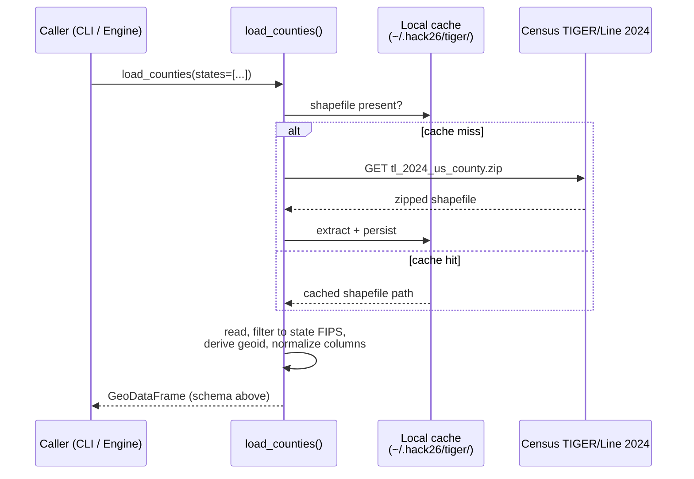

# Geospatial AI Crop Yield Forecasting — System Spec

> Living design doc. We grow this section by section as we build.

## 1. Problem

Forecast **corn-for-grain yield (bu/acre)** for **Iowa, Colorado, Wisconsin, Missouri, Nebraska** at four points in the growing season (Aug 1, Sep 1, Oct 1, final), each wrapped in an analog-year **cone of uncertainty**.

Replacement target: the USDA enumerator survey (~1,600 boots-on-the-ground, ~$1–1.5M per pass, 4×/year, dwindling participation).

## 2. Architecture — "ROI in, forecast out"

```mermaid
flowchart TD
    User["User / CLI"] -->|ROI request<br/>(state or geoid list)| Catalog["County Catalog<br/><i>canonical IDs + geometry</i>"]
    Catalog -->|geoid, geometry, bbox| Engine

    subgraph Engine["Engine — pluggable data sources"]
        direction LR
        HLS["Imagery (HLS)"]
        CDL["CDL (corn mask)"]
        WX["Weather<br/>(POWER, ERA5, GEFS)"]
        SM["Soil moisture<br/>(SMAP)"]
        NASS["NASS yields<br/>(ground truth)"]
    end

    Engine -->|feature frame<br/>ROI × season × as-of date| Model["Model + Analogs<br/><i>yield μ + cone of uncertainty</i>"]
    Model --> Forecast["Forecast<br/>(per state × date)"]
```

Design rules:
- **Everything joins on `geoid`** (5-digit county FIPS).
- **Each Engine source is a function**: `fetch(geoid, geometry, date_range) -> pd.DataFrame`. Sources are independent, cacheable, and individually testable.
- **The County Catalog is the only place geometries live**; downstream sources receive the polygon, never re-derive it.

## 3. Region of Interest (ROI)

MVP scope: **county-level** ROIs in the 5 target states. (We chose county over pixel/state because USDA NASS publishes county-level corn yields → richest training signal at a tractable scale, ~470 counties total.)

Future-friendly: `geometry` is a generic polygon, so any sub-county ROI (a producer's field, a watershed, an AgNext research plot) plugs into the same Engine without changes.

## 4. Component: County Catalog (this PR)

**Purpose.** Return one canonical `GeoDataFrame` of every county in the 5 target states, keyed by `geoid`, with the geometry every other Engine source needs.

**Source.** Census Bureau TIGER/Line 2024 county shapefile — single authoritative file, free, no auth. Cached locally on first call.

**State FIPS in scope.**

| State     | FIPS |
| --------- | ---- |
| Colorado  | 08   |
| Iowa      | 19   |
| Missouri  | 29   |
| Nebraska  | 31   |
| Wisconsin | 55   |

**Output schema.**

| Column          | Type           | Notes                                              |
| --------------- | -------------- | -------------------------------------------------- |
| `geoid`         | str (5)        | Primary key. State FIPS + county FIPS.             |
| `state_fips`    | str (2)        |                                                    |
| `county_fips`   | str (3)        |                                                    |
| `name`          | str            | "Story", "Larimer", …                              |
| `name_full`     | str            | "Story County", "Larimer County", …                |
| `state_name`    | str            | Human-readable state.                              |
| `centroid_lat`  | float          | From TIGER `INTPTLAT` (interior point, not bbox).  |
| `centroid_lon`  | float          | From TIGER `INTPTLON`.                             |
| `land_area_m2`  | int            | TIGER `ALAND`. Useful for per-area normalization.  |
| `water_area_m2` | int            | TIGER `AWATER`.                                    |
| `geometry`      | shapely Polygon | EPSG:4269 (NAD83) as published by Census.         |

**Contract.**
```python
from engine.counties import load_counties
gdf = load_counties()                     # all 5 states
gdf = load_counties(states=["Iowa"])      # subset
```

**Call flow.**



**Non-goals (for now).**
- No reprojection — downstream sources reproject to whatever they need (HLS is in UTM, NASS is FIPS-keyed only, etc.).
- No sub-county geometries.
- No alternate vintages — TIGER 2024 is pinned.

## 5. Open design questions (next pass)

- Modeling: Prithvi-embeddings + GBM regressor vs. hand-crafted NDVI/EVI time-series + GBM as baseline.
- Cone-of-uncertainty feature vector (GDD + precip + season-to-date NDVI trajectory?) and analog-distance metric.
- Deliverable surface: CLI emitting a forecast frame vs. small map UI vs. notebook.
- AgNext framing: tie forecast band to feed-corn cost band → feedlot margin sensitivity.
