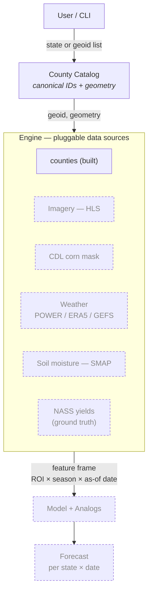
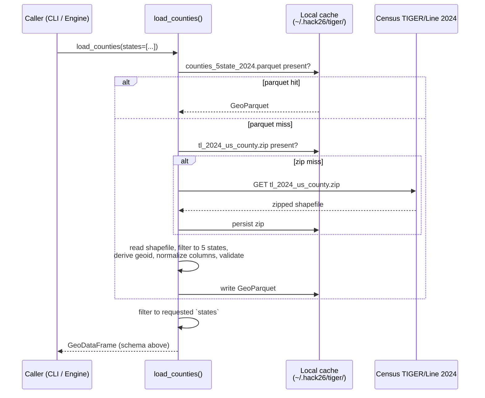

# Geospatial AI Crop Yield Forecasting — System Spec

## 1. Problem

Forecast **corn-for-grain yield (bu/acre)** for **Iowa, Colorado, Wisconsin, Missouri, Nebraska** at four points in the growing season (Aug 1, Sep 1, Oct 1, final), each wrapped in an analog-year **cone of uncertainty**.

Replacement target: the USDA enumerator survey (~1,600 boots-on-the-ground, ~$1–1.5M per pass, 4×/year, with dwindling participation).

## 2. Architecture — "ROI in, forecast out"

Solid boxes are implemented; dashed boxes are planned components that plug into the same Engine contract.



Design rules every Engine source follows:
- **Join key is `geoid`** (5-digit county FIPS).
- **Each source is a function** `fetch(geoid, geometry, date_range) -> pd.DataFrame`. Sources are independent, cacheable, and individually testable.
- **The County Catalog owns geometry.** Downstream sources receive the polygon; they never re-derive it.

## 3. Region of Interest (ROI)

MVP scope is **county-level** ROIs in the 5 target states (443 counties total: CO 64, IA 99, MO 115, NE 93, WI 72). County granularity matches USDA NASS's published corn yields, giving the richest training signal at a tractable scale.

The Engine contract takes a generic polygon, so any sub-county ROI (a producer's field, a watershed, an AgNext research plot) plugs in without code changes.

## 4. Component: County Catalog `engine.counties`

**Purpose.** Return one canonical `GeoDataFrame` of every county in the 5 target states, keyed by `geoid`, carrying the geometry every other Engine source needs.

**Source.** Census Bureau TIGER/Line **2024** national county shapefile — single authoritative file, free, no auth. Pinned vintage. Cached locally on first call.

**State FIPS in scope.**

| State     | FIPS |
| --------- | ---- |
| Colorado  | 08   |
| Iowa      | 19   |
| Missouri  | 29   |
| Nebraska  | 31   |
| Wisconsin | 55   |

**Output schema.**

| Column          | Type            | Notes                                              |
| --------------- | --------------- | -------------------------------------------------- |
| `geoid`         | str (5)         | Primary key. State FIPS + county FIPS.             |
| `state_fips`    | str (2)         |                                                    |
| `county_fips`   | str (3)         |                                                    |
| `name`          | str             | "Story", "Larimer", …                              |
| `name_full`     | str             | "Story County", "Larimer County", …                |
| `state_name`    | str             | Human-readable state.                              |
| `centroid_lat`  | float           | TIGER `INTPTLAT` (interior point, not bbox).       |
| `centroid_lon`  | float           | TIGER `INTPTLON`.                                  |
| `land_area_m2`  | Int64           | TIGER `ALAND`. For per-area normalization.         |
| `water_area_m2` | Int64           | TIGER `AWATER`.                                    |
| `geometry`      | shapely Polygon | EPSG:4269 (NAD83), as published by Census.         |

Invariants asserted before the frame is returned: `geoid` is unique, `geoid` is exactly 5 chars, every row has a non-null geometry.

**Public API.**
```python
from engine.counties import load_counties

gdf = load_counties()                       # all 5 states
gdf = load_counties(states=["Iowa"])        # subset by name or FIPS
gdf = load_counties(refresh=True)           # re-download + rebuild cache
```

`states=` accepts state names ("Iowa") or 2-digit FIPS ("19"); unknown values raise `ValueError`.

**Call flow.**



The cache has two layers: the raw TIGER zip (so a refresh can rebuild without re-downloading ~120 MB) and the normalized 5-state GeoParquet (so warm reads are sub-second). `refresh=True` rebuilds both.

**Cache location.** `~/.hack26/tiger/` by default. Override with the `HACK26_CACHE_DIR` environment variable (the `tiger/` subdir is appended automatically).

**Non-goals.**
- No reprojection — downstream sources reproject to whatever they need (HLS → UTM, NASS → FIPS-keyed only).
- No sub-county geometries.
- No alternate vintages — TIGER 2024 is pinned via `TIGER_YEAR` in `engine/counties.py`.

## 5. Repository layout

```
hack26/
├── pyproject.toml           # source of truth for deps, package config, pytest
├── software/
│   ├── requirements.txt     # locked runtime deps (uv pip compile output)
│   ├── requirements-dev.txt # locked runtime + dev deps
│   ├── engine/
│   │   ├── __init__.py      # re-exports load_counties
│   │   └── counties.py      # County Catalog implementation + CLI
│   └── tests/
│       └── test_counties_smoke.py
└── .venv/                   # local environment (gitignored)
```

Local cache (gitignored, lives outside the repo): `~/.hack26/tiger/`.

## 6. Operations

### 6.1 First-time environment setup

Requires Python ≥ 3.11. `uv` is recommended for speed but optional.

```powershell
# Option A — uv (fast)
python -m uv venv .venv --python 3.13
python -m uv pip install --python .venv\Scripts\python.exe -e ".[dev]"

# Option B — stock pip + venv
python -m venv .venv
.venv\Scripts\python.exe -m pip install -e ".[dev]"
```

Cloud worker (no editable install needed if you only want to run, not modify):
```bash
pip install -r software/requirements.txt
pip install -e .   # registers the `engine` package
```

### 6.2 Running the County Catalog

Module form:
```powershell
.venv\Scripts\python.exe -m engine.counties                       # download + cache, print summary
.venv\Scripts\python.exe -m engine.counties --refresh             # force re-download + rebuild
.venv\Scripts\python.exe -m engine.counties --states Iowa Colorado
.venv\Scripts\python.exe -m engine.counties --out catalog.parquet # also export a copy (.parquet or .csv)
```

Console-script form (after editable install):
```powershell
.venv\Scripts\hack26-counties.exe --states Iowa
```

### 6.3 Tests

```powershell
.venv\Scripts\python.exe -m pytest software\tests -v
```

The smoke test (`software/tests/test_counties_smoke.py`) loads Colorado, eyeballs the first 5 counties, and asserts schema + filter + geometry validity + centroid-in-CO-bbox. Standalone form prints a human-readable report:

```powershell
.venv\Scripts\python.exe software\tests\test_counties_smoke.py
```

Expected first run: ~10 s (TIGER download). Cached runs: <1 s.

### 6.4 Refreshing the dependency lock

When `pyproject.toml`'s `[project.dependencies]` or `[project.optional-dependencies]` change:

```powershell
python -m uv pip compile pyproject.toml -o software\requirements.txt
python -m uv pip compile pyproject.toml --extra dev -o software\requirements-dev.txt
```

### 6.5 Refreshing the TIGER cache

```powershell
.venv\Scripts\python.exe -m engine.counties --refresh
```

Or, to start fully clean:

```powershell
Remove-Item -Recurse -Force $HOME\.hack26
```

### 6.6 Environment variables

| Var                  | Default              | Effect                                                        |
| -------------------- | -------------------- | ------------------------------------------------------------- |
| `HACK26_CACHE_DIR`   | `~/.hack26`          | Root for all source caches. `tiger/` subdir created underneath. |
